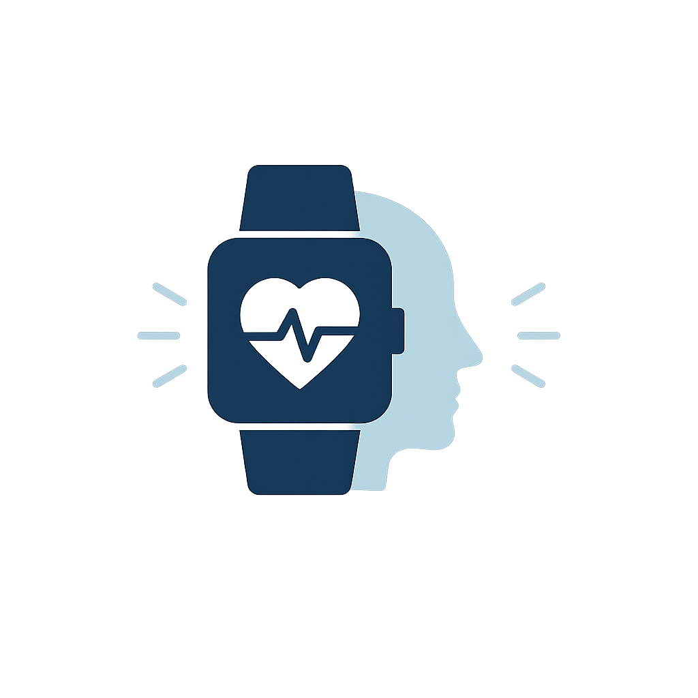

# 🧠 Synaptis - Emotional Insight Platform

**Platforma do analizy emocji pacjentów na podstawie danych biometrycznych z opaski Empathica**

🥈 *Projekt, który zdobył **2. miejsce** podczas hackathonu **UBIHACK 2.0***

---

## 🎯 O projekcie

**Synaptis** to inteligentna platforma analizująca emocje pacjentów na podstawie danych biometrycznych zebranych przez opaskę **Empathica**.  
System integruje pomiary potliwości skóry (EDA), tętna (HR) oraz innych wskaźników, aby wspomóc psychologów w zrozumieniu emocji pacjenta podczas sesji terapeutycznej.

Po zakończeniu rozmowy dane są przesyłane do aplikacji, gdzie **algorytmy analizy** wizualizują poziom emocji pacjenta w czasie rzeczywistym.  
Celem projektu jest **lepsze zrozumienie emocji i stresu** pacjentów poprzez połączenie biometrii, analizy danych i psychologii.

---

## 🚀 Kluczowe funkcje

- 🩺 **Analiza biometryczna** – przetwarzanie EDA, HR i wskaźników stresu  
- 🧘 **Mapowanie emocji** – wizualizacja emocji w czasie rozmowy  
- 🔄 **Integracja z Empathica** – import danych z urządzenia po sesji  
- 📊 **Interaktywne wykresy (D3.js)** – analiza w czasie rzeczywistym  
- 🧑‍⚕️ **Panel terapeuty** – przegląd historii pacjentów i sesji  
- 🔐 **Bezpieczne przechowywanie danych** – autoryzacja JWT i Docker  

## 🔧 Moduły systemu

### 🧑‍⚕️ Patient Management Module
- Rejestracja i zarządzanie pacjentami  
- Przypisywanie sesji terapeutycznych  
- Historia biometryczna pacjentów  

### 💬 Session Analysis Module
- Przetwarzanie danych z opaski Empathica  
- Synchronizacja z nagraniem rozmowy  
- Generowanie map emocjonalnych w czasie sesji  

### 📈 Stress Classification Module
- Analiza sygnałów EDA i HR  
- Klasyfikacja emocji z wykorzystaniem modeli ML  
- Tworzenie raportów emocjonalnych dla psychologa  

### 🛡️ Security Module
- **JWT Authentication** – bezpieczne logowanie  
- **Zarządzanie użytkownikami** – terapeuci i pacjenci  
- **Ochrona tras API** – kontrola dostępu  

---

## 🛠️ Technologie

### Backend
- **Django REST Framework** – serwer API  
- **Python** – analiza i przetwarzanie danych biometrycznych  
- **PostgreSQL** – baza danych  
- **Docker** – izolacja środowiska uruchomieniowego  

### Frontend
- **React 19 + Vite** – szybki interfejs użytkownika  
- **Material UI (MUI)** – stylowanie i design  
- **D3.js** – wizualizacja danych biometrycznych  
- **Axios** – komunikacja z API  

---

## 📊 Dane biometryczne

### Rejestrowane parametry:
- 💧 *EDA (Electrodermal Activity)* – potliwość skóry  
- ❤️ *Heart Rate (HR)* – tętno pacjenta  
- 🔥 *Stress Index* – poziom stresu  
- 🕒 *Timestamp* – synchronizacja emocji z przebiegiem rozmowy  

Dane te są automatycznie analizowane, klasyfikowane i wizualizowane w panelu terapeuty, pozwalając lepiej zrozumieć emocjonalny przebieg sesji.

---

## 📈 Funkcje biznesowe

### Dla terapeutów:
- 🧭 **Analiza emocji** – lepsze zrozumienie reakcji pacjenta  
- 💡 **Wizualizacja danych** – intuicyjne wykresy emocji  
- 📁 **Historia sesji** – pełen wgląd w postępy pacjenta  
- 🔐 **Bezpieczne dane** – poufność informacji  

---

## 🏆 Wyróżnienie

> 🥈 Projekt **Synaptis** zdobył **2. miejsce** podczas **UBIHACK 2.0**, hackathonu poświęconego analizie danych medycznych oraz ich wykorzystaniu w ciekawy sposób.

---

## 👥 Zespół

**Synaptis Team**  
Mateusz Ciołkowski - backend, devops
Aleksander Kaźmierczka - backend, analiza danych 
Szymon Kaźmierczak - frontend
Filip Wasiel - frontend

---

## 🚀 Kierunki rozwoju

- 🤖 **Integracja AI** – automatyczna klasyfikacja emocji  
- 📱 **Aplikacja mobilna** – analiza w czasie rzeczywistym  
- 🧠 **Zaawansowana analityka** – modele uczenia maszynowego  
- 🌐 **Panel pacjenta** – dostęp do wyników i postępów  

---
